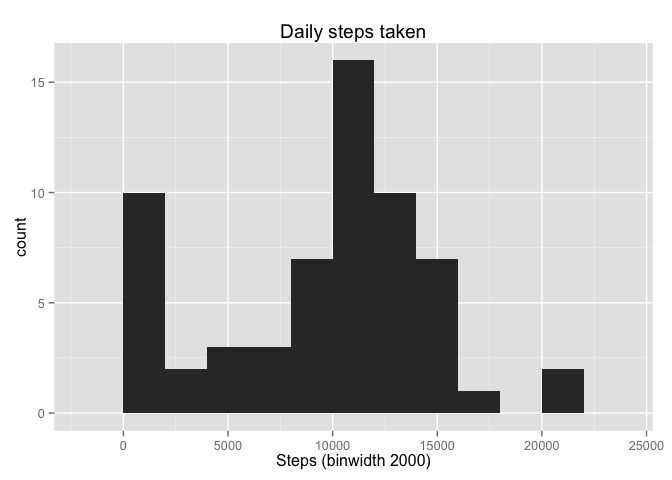
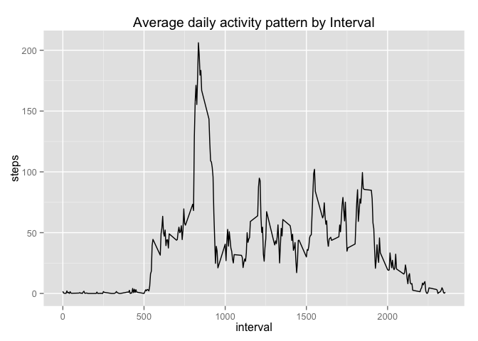
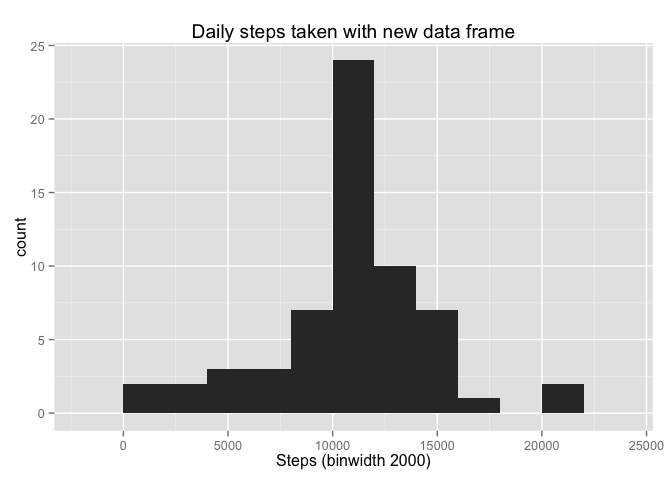
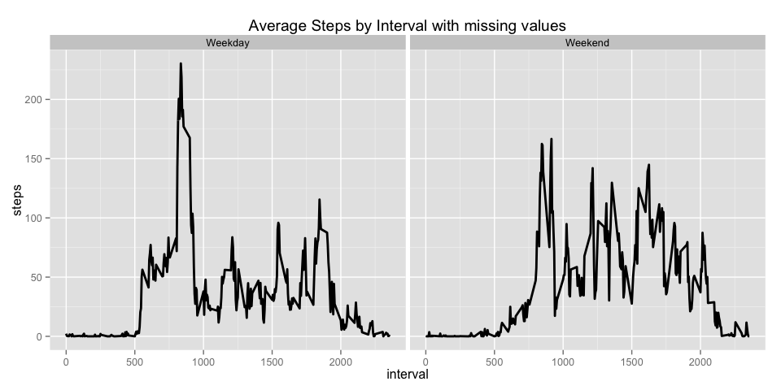

# Reproducible Research: Peer Assessment 1


## Loading and preprocessing the data


```r
unzip("activity.zip", "activity.csv")

data <- read.csv("activity.csv")

data$date <- as.Date(data$date)
```

## What is mean total number of steps taken per day?


```r
library(ggplot2)
total.steps.taken.per.day <- aggregate(x = data$steps , by = list(data$date), FUN = sum, na.rm = TRUE)

names(total.steps.taken.per.day) <- c("date", "steps")

histplot <- ggplot(total.steps.taken.per.day, aes(x = steps)) +
            ggtitle("Daily steps taken") +
            xlab("Steps (binwidth 2000)") +
            geom_histogram(binwidth = 2000)
histplot
```

 

```r
#mean total number of steps taken per day
mean(total.steps.taken.per.day$steps, na.rm = TRUE)
```

```
## [1] 9354.23
```

```r
#median total number of steps taken per day
median(total.steps.taken.per.day$steps , na.rm = TRUE)
```

```
## [1] 10395
```

## What is the average daily activity pattern?


```r
average.steps.by.interval  <- aggregate(x = data$steps, by = list(data$interval), FUN = mean, na.rm = TRUE)

names(average.steps.by.interval) <- c("interval", "steps")

avg.step.line <- ggplot(average.steps.by.interval, aes(interval, steps)) +
                 ggtitle("Average daily activity pattern by Interval") +
                 geom_line()
avg.step.line
```

 

```r
# 5-minute interval, on average across all the days in the dataset
average.steps.by.interval[which.max(average.steps.by.interval$steps), c("interval")]
```

```
## [1] 835
```

## Imputing missing values


```r
# Total number of missing values
nrow(data[is.na(data$steps),])
```

```
## [1] 2304
```

```r
data.with.missing <- merge(x = data, y = average.steps.by.interval, by = "interval", all.x = TRUE)

data.with.missing[is.na(data.with.missing$steps.x), c("steps.x")] <- data.with.missing[is.na(data.with.missing$steps.x), c("steps.y")]

#cleaning data
data.with.missing$date <- as.Date(data.with.missing$date)
data.with.missing$date.x <- NULL
data.with.missing$Group.1 <- NULL
data.with.missing$steps <- data.with.missing$steps.x
data.with.missing$steps.x <- NULL
data.with.missing$steps.y <- NULL

#histogram with new dataframe
total.steps.taken.per.day <- aggregate(x = data.with.missing$steps , by = list(data.with.missing$date), FUN = sum, na.rm = TRUE)
names(total.steps.taken.per.day) <- c("date", "steps")
histplot <- ggplot(total.steps.taken.per.day, aes(x = steps)) +
            ggtitle("Daily steps taken with new data frame") +
            xlab("Steps (binwidth 2000)") +
            geom_histogram(binwidth = 2000)
histplot
```

 

```r
#mean total number of steps taken per day
mean(total.steps.taken.per.day$steps , na.rm = TRUE)
```

```
## [1] 10766.19
```

```r
#median total number of steps taken per day
median(total.steps.taken.per.day$steps , na.rm = TRUE)
```

```
## [1] 10766.19
```

## Are there differences in activity patterns between weekdays and weekends?

```r
#Factor variable with two levels indicating a weekday or weekend.
data.with.missing$weekday <- as.factor(ifelse(weekdays(data.with.missing$date) %in% c("Saturday","Sunday"), "Weekend", "Weekday")) 

average.steps.per.interval.and.weekday  <- aggregate(x = data.with.missing$steps , 
                                                    by = list(data.with.missing$interval, data.with.missing$weekday), FUN = mean, na.rm = TRUE)
names(average.steps.per.interval.and.weekday) <- c("interval", "weekday", "steps")

#5-minute interval and the average number of steps taken 
#averaged across all weekday days or weekend days.
avg.step.line <- ggplot(average.steps.per.interval.and.weekday, aes(interval, steps)) +
                 ggtitle("Average Steps by Interval with missing values") +
                 facet_grid(. ~ weekday) +
                 geom_line(size = 1)
avg.step.line  
```

 
